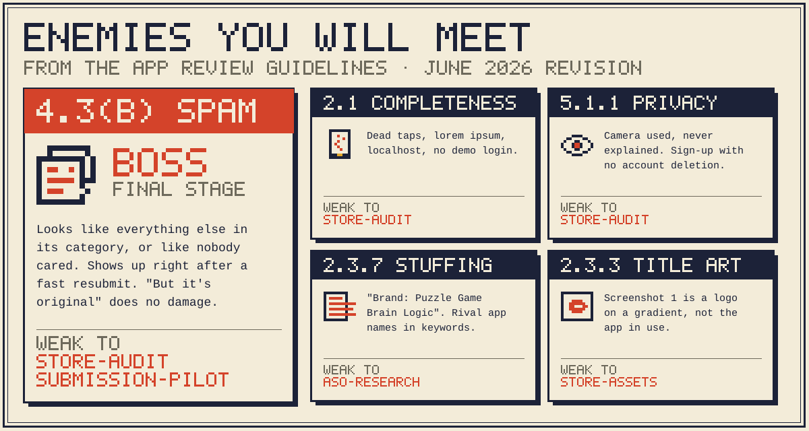

<div align="center">



**Your app builds. This kit gets it approved and discovered.**

Four agent skills for Claude Code and any agent that reads `SKILL.md`.<br>
Free, MIT, Python standard library only, no telemetry.

[Install](#1-1--install) · [How to play](#1-2--how-to-play) · [Enemies](#1-3--enemies) · [House rules](#1-4--house-rules) · [Proof](#1-6--proof-it-works) · [The 4.3(b) playbook](docs/4-3b-playbook.md)

</div>

<br>

## Before you start

You can get an app to "it builds" in a weekend now. App Review is where many of those apps stop, most often on
**Guideline 4.3 (spam)**: the app looks like everything else in its category, or like nobody cared.

store-ready-kit puts App Review know-how inside the agent that is already building your app. It audits the app
the way a reviewer will meet it, finds keywords and plans screenshots without breaking the rules, and when a
rejection arrives it tells you whether to answer, fix, rework or stop, before a resubmission loop puts your
developer account at risk.

> [!NOTE]
> Nothing here promises approval, and nothing here helps anyone get around App Review. Guidance is based on the public App Review Guidelines (**revision of 8 June 2026, last checked 2026-10-04**); Apple's decisions are their own.

<br>

## 1-1 · Install

You need **Python 3.9+** and an agent that loads skills from a folder (Claude Code does). Nothing to `pip install`.

```bash
git clone https://github.com/agshinrajabov/store-ready-kit
cd store-ready-kit
./install.sh
```

That symlinks the four skills into `~/.claude/skills/`. **Restart your agent session** so it picks them up.
Because they are symlinks, `git pull` updates them in place.

| Option | What it does |
|---|---|
| `./install.sh --copy` | Copy the skills instead of linking (use this if you move or delete the clone) |
| `./install.sh --dest .claude/skills` | Install into one project only, from that project's root |
| `./install.sh --only store-audit,submission-pilot` | Install some of the skills |
| `./install.sh --uninstall` | Remove what this script installed. Other skills are left alone |

<details>
<summary><b>Other agents, manual install, Windows</b></summary>
<br>

Any agent that reads `SKILL.md` folders works: copy or link each folder in `skills/` to wherever your agent
looks for skills. On Windows without bash, copy the four folders by hand:

```powershell
Copy-Item -Recurse skills\* $HOME\.claude\skills\
```

The scripts run with `python` or `python3`, whichever your system has.
</details>

**Check that it works.** This runs the whole test suite offline in about a second:

```bash
python3 evals/run_evals.py
```

<br>

## 1-2 · How to play

Open your app's repository in your agent and say what you need in plain words. The right skill loads by itself.
**You never run a command.** The agent reads the skill's instructions and runs its helper scripts for you.

| Skill | Say something like | You get |
|---|---|---|
| **`store-audit`** | *"Audit my app before I submit it."* | A 4.3 clone-signal score against your real competitors, plus checks for crashes, placeholders, metadata, privacy strings and runtime code download. A P0/P1/P2 fix list and a draft of your App Review notes. |
| **`submission-pilot`** | *"Apple rejected my app. Here's the letter."* | One of five paths (answer, fix, clarify, rework or stop), your account-risk level, a linted Resolution Center reply, and a clear "don't resubmit yet" when that's the honest answer. |
| **`aso-research`** | *"What should my name, subtitle and keywords be?"* | Keywords from public App Store data in each storefront, plus name, subtitle and 100-character keyword variants that always pass the character-limit and 2.3.7 linter. |
| **`store-assets`** | *"Plan my App Store screenshots."* | The first three frames, the full screenshot story, outcome-first captions, an icon brief and a 15–30 s preview script, plus a check of your exported files against Apple's sizes. |

Here is what a session looks like on a real rejection (anonymised, stylised output):



### A good order

1. **Before your first submission:** `store-audit`, then `aso-research` and `store-assets`, then the
   `submission-pilot` pre-flight checklist.
2. **After a rejection:** `submission-pilot` first. It sends you back to `store-audit` if the build needs to
   change.

### Save files

Every skill keeps its work in a dated folder at your project root, so you can rerun or compare later:
`store-audit/<date>/`, `aso/<date>/`, `assets/<date>/` and `submission/<date>/`. The competitor snapshots are
frozen in there too, so a score can be reproduced.

<br>

## 1-3 · Enemies



<details>
<summary><b>The same list as text</b></summary>
<br>

| Guideline | What it looks like | Weak to |
|---|---|---|
| **4.3(b) Spam** (boss) | The app looks like everything else in its category, or like a low-effort package. It often shows up right after a fast resubmission. | `store-audit`, `submission-pilot` |
| **2.1 Completeness** | Dead taps, lorem ipsum, localhost URLs, no demo account for the reviewer | `store-audit` |
| **5.1.1 Privacy** | A permission used with no purpose string, sign-up with no account deletion, a policy that doesn't match the code | `store-audit` |
| **2.3.7 Keyword stuffing** | "Brand: Puzzle Game Brain Logic", competitor names in the keyword field | `aso-research` |
| **2.3.3 Title-art screenshots** | Screenshot 1 is a logo on a gradient instead of the app in use | `store-assets` |

</details>

<br>

## 1-4 · House rules

The skills refuse these, even when asked, and explain the honest alternative:

- keyword stuffing, competitor names or trademarks in your metadata;
- fake or incentivised reviews, rating manipulation;
- a new bundle ID or account to dodge a rejection, hiding features from the reviewer;
- statistics without a source. (You'll see "4.3 is 28% of rejections" online. We couldn't find where it
  comes from, so the kit never uses it.)

**Guidelines go stale.** Every reference file records the guideline numbers it summarises and the date it was
last checked. If Apple publishes a newer revision than **8 June 2026**, treat the references as possibly out of
date, and please open an issue.

<br>

## 1-5 · How a skill works inside

Each skill is a folder the agent reads, not a program you run:

```
skills/store-audit/
├── SKILL.md       the instructions: when to start, which steps, which rules never to break
├── references/    what the agent reads when it needs it (guideline summaries, templates)
└── scripts/       small Python helpers the agent runs on its own
```

The scripts exist for the jobs a language model does badly: counting characters exactly, calling Apple's public
APIs, parsing `Info.plist` files, and scoring the same input the same way every time, so the 54 evals can check
it. **The script measures, the agent judges**: a script reports "15 of 16 template traits, FLAG", and the agent
explains which part of 4.3 is at risk and what to change first.

You only need the commands below to run a script by hand, for example in CI. Every script prints `--help`.

<details>
<summary><b>store-audit</b>: 5 scripts</summary>
<br>

| Script | Does |
|---|---|
| `competitor_scan.py` | Your niche from the public iTunes Search API, frozen as a snapshot |
| `similarity_score.py` | Nine clone signals, a per-prong 4.3 score, PASS / WARN / FLAG |
| `completeness_scan.py` | Placeholders, dev endpoints, beta wording, OTA updates, `eval`, web wrappers, app-builder scaffolds |
| `privacy_check.py` | Code ↔ Info.plist / AndroidManifest / Expo config ↔ purpose strings ↔ policy, privacy manifest, account deletion, Sign in with Apple |
| `audit_report.py` | Everything above as one scored report with a fix list and review notes |

```bash
python3 skills/store-audit/scripts/competitor_scan.py --term "habit tracker" --limit 50 -o competitors.json
python3 skills/store-audit/scripts/similarity_score.py --listing listing.json --competitors competitors.json --format md
```
</details>

<details>
<summary><b>submission-pilot</b>: 3 scripts</summary>
<br>

| Script | Does |
|---|---|
| `rejection_triage.py` | Rejection letter → path (answer / fix / clarify / rework / stop) and account risk |
| `preflight.py` | A pre-submission checklist built from your app's features, guideline by guideline |
| `message_lint.py` | Lints review notes, replies and appeals: placeholders, pleading, originality arguments against a quality letter |

```bash
python3 skills/submission-pilot/scripts/rejection_triage.py --letter letter.txt --prior-4-3 0 --similar-apps 0
```
</details>

<details>
<summary><b>aso-research</b>: 3 scripts</summary>
<br>

| Script | Does |
|---|---|
| `keyword_rank.py` | `apps`, `expand`, `reviews`, `score`, `charts`: competitor IDs, autocomplete, review mining, per-storefront popularity proxy and difficulty, chart depth |
| `keyword_pack.py` | Packs the 100-character keyword field. Never over the limit, never reassembles a blocked brand |
| `char_lint.py` | Character limits, 2.3.7 blocks (including brands split across fields), wasted characters |

```bash
python3 skills/aso-research/scripts/char_lint.py --name "Leafwise" --subtitle "Keep every houseplant alive" --keywords "plant,watering,succulent"
```
</details>

<details>
<summary><b>store-assets</b>: 2 scripts</summary>
<br>

| Script | Does |
|---|---|
| `plan_lint.py` | Checks a screenshot plan: frame 1 is the app in use, frames 1–3 are distinct, no prices, awards, platforms or rival names |
| `asset_check.py` | Checks exported PNG/JPEG files against App Store Connect sizes, alpha, CMYK and the 10-per-set limit |

```bash
python3 skills/store-assets/scripts/asset_check.py exports/iphone/*.png --icon icon-1024.png --platform iphone
```
</details>

<br>

## 1-6 · Proof it works

```bash
python3 evals/run_evals.py          # 54 cases, offline, under a second
python3 evals/run_evals.py -v       # with every signal's evidence
```

| Group | What has to happen |
|---|---|
| Golden rejection | A real 4.3(b) rejection, anonymised and used with permission, is **flagged**, for the reasons the fix has to move |
| Golden approved | Railbound, Things 3, Halide and Flighty are **not** flagged |
| Hard cases | A flashlight with an SOS mode, a screw-puzzle reskin, an AI chat wrapper, a climbing app that sounds like dating, an honest game with a stuffed name, and the rejected game after its fix |
| Triage | Letters land on the right path, including the third-4.3 "stop" |
| Character limits | Generated metadata never goes over 30 / 30 / 100, in any script |

Agent-level rubrics in `evals/agent/` test the judgement the scripts can't. What the evals do **not** prove is
written down in [`evals/README.md`](evals/README.md).

<br>

## Troubleshooting

<details>
<summary><b>The agent doesn't use the skills</b></summary>
<br>

Restart the session after installing. Check that the folders exist with `ls ~/.claude/skills`. Ask in words that
match the skill, for example *"audit my app for App Review"*.
</details>

<details>
<summary><b>Requests to Apple fail or come back with 403</b></summary>
<br>

The public endpoints throttle at roughly 20 requests a minute. The scripts pace themselves and retry. On a big
run, use `keyword_rank.py score --no-popularity` first and probe popularity only for your best 15–20 terms.
</details>

<details>
<summary><b>The 4.3 score says FLAG, but the total is under 55</b></summary>
<br>

That's a hard trigger: the niche's template is on screen **and** monetisation or generated content leads the
first session (the low-effort prong). Read the per-prong scores and the evidence lines, not only the total.
</details>

<br>

## FAQ

<details>
<summary><b>Will this get my app approved?</b></summary>
<br>

No tool can promise that. It finds what a reviewer is likely to object to, while it is still cheap to fix, and
helps you explain the app clearly.
</details>

<details>
<summary><b>Does it send my code anywhere?</b></summary>
<br>

No. The scripts read your project locally. The only network calls go to Apple's public search, autocomplete,
review and chart endpoints, and they send search terms and App Store IDs, never your code.
</details>

<details>
<summary><b>Android?</b></summary>
<br>

Google Play variants are next on the [roadmap](ROADMAP.md). The privacy and completeness scans already read
Android manifests.
</details>

<br>

## Contributing

The most useful thing you can give this project is **a real rejection letter**, anonymised, as a test case. See
[adding a case](evals/README.md#adding-a-case). Next most useful: a guideline change, as an issue with the
guideline number and what changed.

Related: [no-slop-design](https://github.com/agshinrajabov/no-slop-design) does the visual pass for screenshots
and icons. `store-assets` plans, no-slop-design draws.

The README art is generated, not drawn by hand: `python3 tools/readme_art.py` rebuilds every SVG in
`assets/readme/`.

<br>



<div align="center">
<sub>MIT · <a href="CHANGELOG.md">Changelog</a> · <a href="ROADMAP.md">Roadmap</a> · Guidance based on public App Review Guidelines; Apple's decisions are their own.</sub>
</div>
